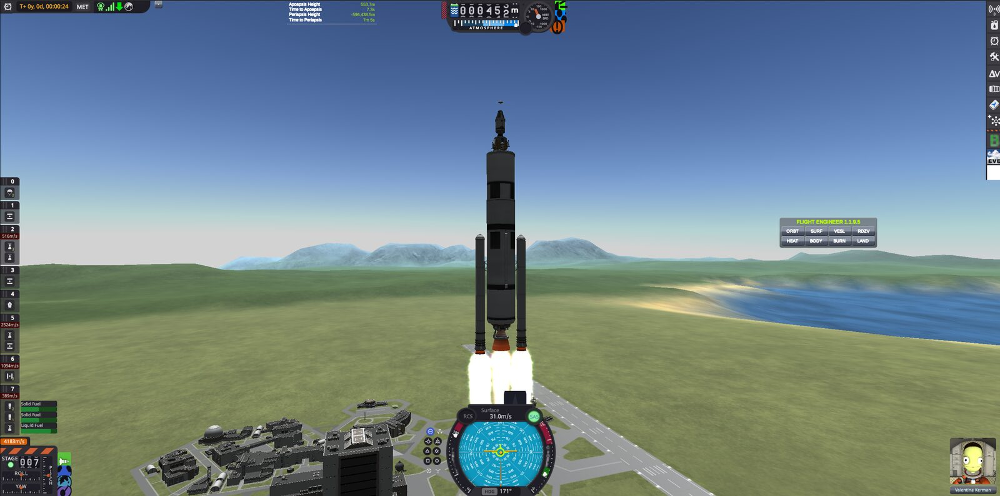
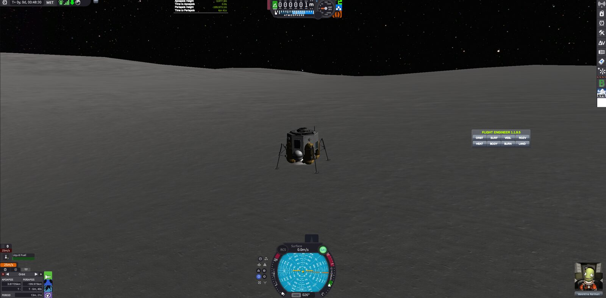
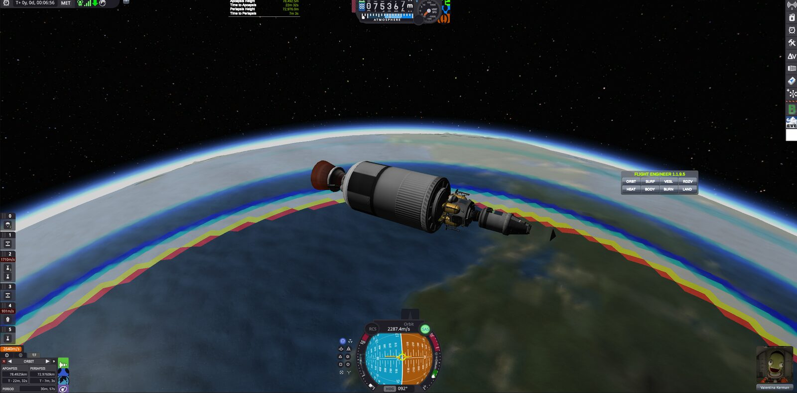
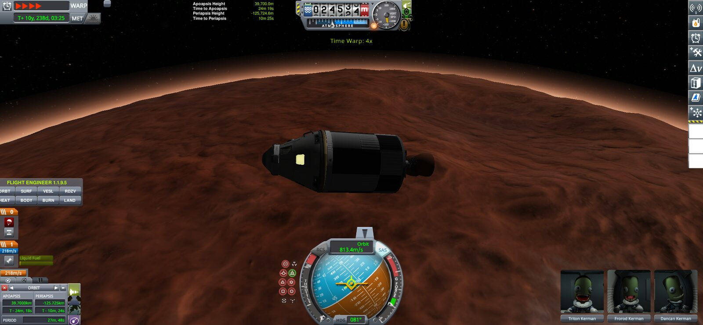

# KSPWeb

Kerbal Space Program 1 in the browser. Ported by woahhcrackers!

**Play it NOW!** https://ksp.ishotupa.school

Want it offline? Grab the zip from https://cloud.ishotupa.school/ksp.zip, unzip it and serve it with any static web server, like `npx serve`. The zip has the base game, mods, and a little CKAN remake. There's also a single file version that's coming soon.

It's a big download and a hungry page, as it's not quite a slim game. Expect it to use around 3 GB of RAM, so close some tabs first.

Screenshots by barneythegod and crackers.

## Mods

These are some mods, but not all of them:

- [MechJeb2](https://github.com/MuMech/MechJeb2)
- [Kerbal Engineer Redux](https://github.com/CYBUTEK/KerbalEngineer)
- [kOS](https://github.com/KSP-KOS/KOS)
- [Trajectories](https://github.com/neuoy/KSPTrajectories)
- [BackgroundThrust](https://github.com/Phantomical/BackgroundThrust)
- BetterTimeWarp
- [ZTheme](https://github.com/zapSNH/ZTheme)
- [EVE](https://github.com/LGhassen/EnvironmentalVisualEnhancements)
- [KSP Community Fixes](https://github.com/KSPModdingLibs/KSPCommunityFixes) (some patches)

## What's broken

Lots of stuff, it's early. The big ones:

- The VAB is white ([#3](../../issues/3), [#18](../../issues/18))
- Can't type in text boxes ([#1](../../issues/1))
- Can't right click parts ([#5](../../issues/5))
- Water and fairings are invisible ([#7](../../issues/7), [#8](../../issues/8))
- UI is scaled up and some icons are missing ([#6](../../issues/6), [#4](../../issues/4))
- F5 reloads the page instead of quicksaving ([#9](../../issues/9))
- Crashes on Chromebooks and when starting a new world ([#11](../../issues/11), [#12](../../issues/12))
- Fuel tanks with built in fuel count it twice ([#2](../../issues/2))

Everything else is on the [issues page](../../issues). If you hit something new and undiscovered, don't be afraid to make an issue!

The DLCs are coming in service pack 1.

Kerbal Space Program belongs to Squad and Take-Two. This is a fan project and has nothing to do with them.
